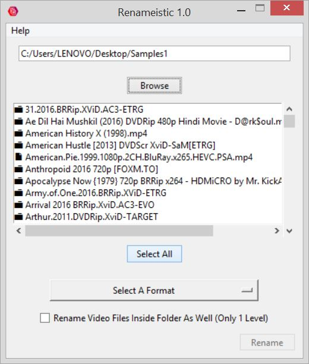
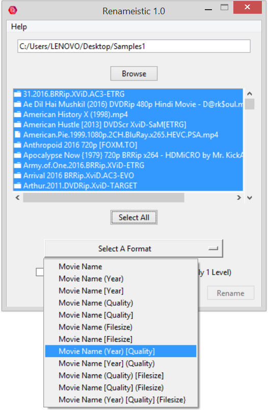
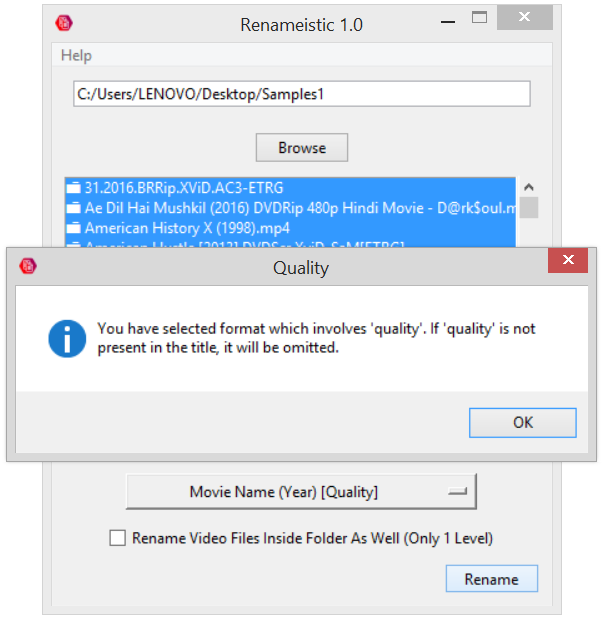
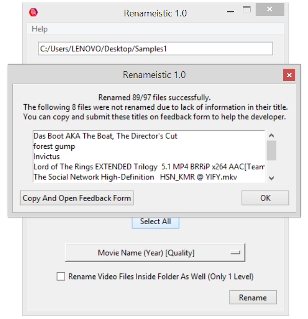
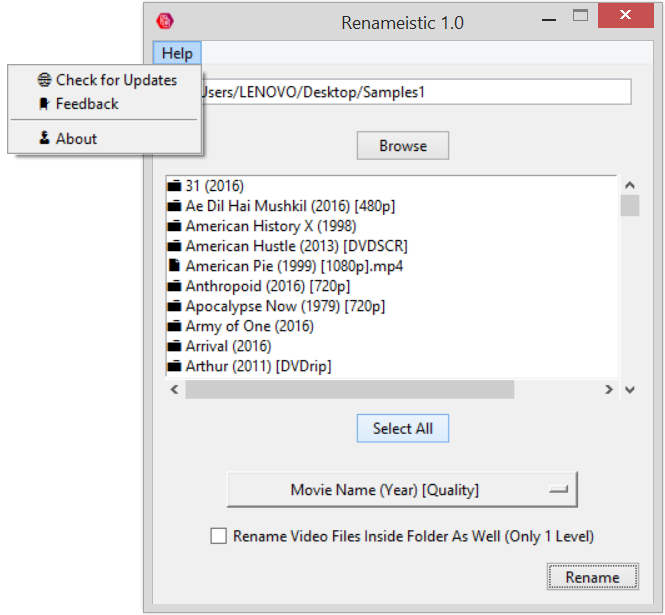

📢 Due to a recent change made in repos, if the "check for updates" feature is giving you trouble, please download the latest version from below and it will be fixed.

# Renameistic - Movie Title Cleaner

## 📥 Download Latest Version:

## 📝 Description:

We all have movies downloaded or taken from someone else that looks something like this: **The.Movie.Name.Goes.Here.2021.720p.WebDL.x265.HEVC--somesuffixhere**

Ask anyone, this naming style does not look good. The only reason we keep it this way is that no one wants to go through the painstaking process of editing all of their movie titles one by one.

This is where **Renameistic** comes into play

A simple utility to clean all your movie titles with just one click. No more unnecessary clutter in the titles. Yayy!

## 🔧 Features:

- **High Accuracy:** Tested on **4000+** titles with an average accuracy of **94%**.
- **Works Offline:** Unlike similar softwares, renameistic does not use IMDB/MovieDB API to work therefore completely eliminating the need for an internet connection. (Unless checking for updates).
- **No Database:** Works on the concept of string manipulation.
- **Multiple Formats:** Total 12 as of now.
- **Will Receive Regualar Updates:** To improve performance and add new features.
- **Portable:** No Installation Required.
- **Lightweight:** File size is 9 MB.

## 📷 Screenshots:

## 📜 Instructions:

**Step 1)** Download and extract renameistic from zip file. **Please do not remove or change directory of the "assets" folder or else it will not work.**

**Step 2)** Click on browse button and select the folder containing your movies. The box will be populated with the list.

**Step 3)** Select the folders/files that you want to edit or simply click on "Select All" button to well....select all.

**Step 4)** Select the desired format from the dropdown and click on "rename".

**Checking for updates)** Go to Help -> Check for Updates. If a newer version is available it will inform you and will bring you to this page for downloading.

## 🙏 Credits:

- Special thanks to [Arushi Kothari](http://www.linkedin.com/in/arushi-kothari) for scraping the torrent website and providing me thousands of titles to test on.
- Special thanks to [Moinuddin Sheikh](http://linkedin.com/in/moinuddin-sheikh) for providing his valueable insights.
- [Icon](https://www.iconfinder.com/icons/7120953/document_file_files_icon "Icon") obtained from [Creative Red Icon Pack](https://www.iconfinder.com/iconsets/creative-red "Creative Red Icon Pack") designed by [Tanvir Hira](https://www.iconfinder.com/tanviralamhira "Tanvir Hira") on [iconfinder.com](https://www.iconfinder.com/ "iconfinder.com")

## ✉️ Feedback/Contact:

If you have any feature suggestions, bug reports or any feedback in general, you can fill the [feedback form](https://forms.gle/uwgAvhrEa6KCeLnV8).
